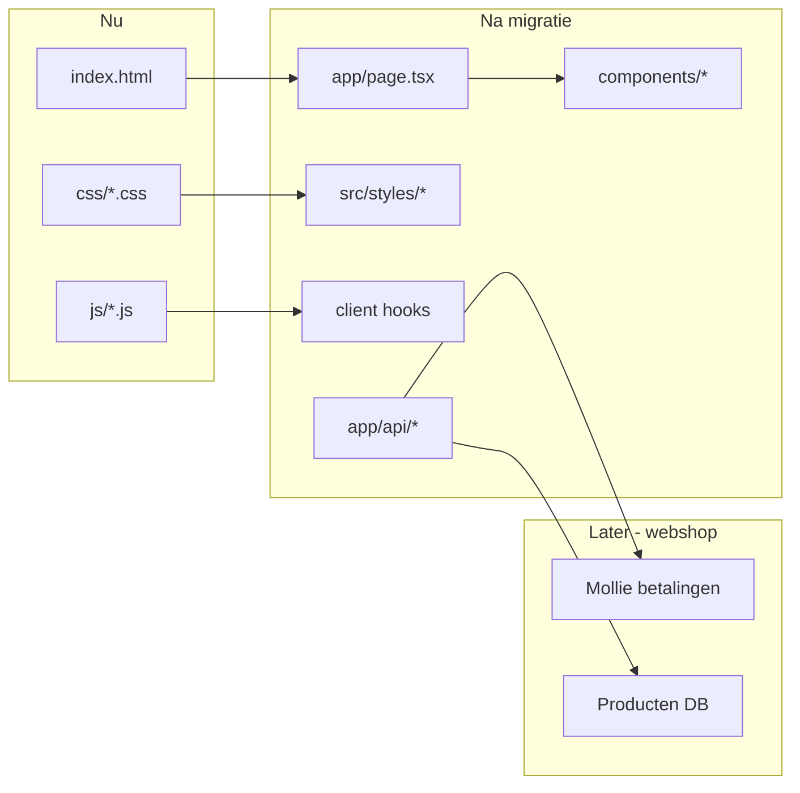
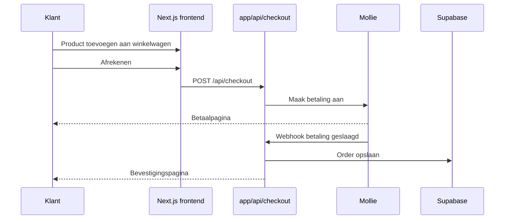

# Migratie Flawless Beauty naar Next.js

## Waarom Next.js (en niet alleen React)?

React alleen (`Vite + React`) levert alleen een frontend. Voor een webshop met betalingen heb je server-side logica nodig (API-keys, orderverwerking, webhooks). **Next.js** combineert React met ingebouwde API-routes — precies wat je nodig hebt, en het deployt naadloos op **Vercel**.




## Kernprincipe: niets aan het uiterlijk wijzigen

- Alle CSS-bestanden uit `[css/](css/)` worden **ongewijzigd** gekopieerd en geïmporteerd in `[src/app/layout.tsx](src/app/layout.tsx)`
- Alle class-namen, HTML-structuur en `data-`* attributen blijven identiek
- Geen Tailwind, geen CSS-herstructurering
- Gewone `` en `<video>` tags (geen `next/image`) om pixel-perfect gedrag te behouden
- Salonized-widgets blijven via dezelfde externe scripts (`[index.html` regels 449–502](index.html))

## Projectstructuur (na migratie)

```
flawlessbeauty-refactor/
├── public/
│   └── img/                    # alle bestaande assets (incl. .webm video's)
├── src/
│   ├── app/
│   │   ├── layout.tsx          # fonts, meta, globale CSS-imports
│   │   ├── page.tsx            # hoofdpagina (samengesteld uit secties)
│   │   └── api/                # leeg voor nu; klaar voor webshop-fase
│   ├── components/
│   │   ├── IntroLoader.tsx     # client — intro animatie
│   │   ├── CustomCursor.tsx    # client — cursor dot/ring
│   │   ├── Navbar.tsx          # client — mobiel menu toggle
│   │   ├── HeroVideo.tsx
│   │   ├── Prelude.tsx
│   │   ├── Treatments.tsx      # client — accordion toggleDescription
│   │   ├── PriceList.tsx
│   │   ├── About.tsx
│   │   ├── StudioGallery.tsx
│   │   ├── Products.tsx
│   │   ├── Giftcard.tsx
│   │   ├── SalonizedWidgets.tsx # next/script voor booking + reviews
│   │   ├── Footer.tsx
│   │   └── ScrollAnimations.tsx # client — reveal, parallax, scroll indicator
│   ├── hooks/
│   │   └── useSlideshow.ts     # port van js/slideshow.js
│   └── styles/                 # kopie van css/*.css (zelfde inhoud)
├── package.json
└── next.config.ts
```

## Stap-voor-stap migratie

### Stap 1 — Next.js project opzetten

- `create-next-app` in de repo-root: TypeScript, App Router, **geen** Tailwind, `src/` directory
- `[index.html](index.html)`, `[js/](js/)`, `[css/](css/)` blijven tijdelijk als referentie tot de migratie klaar is

### Stap 2 — Assets en styles verplaatsen

- `[img/](img/)` → `public/img/` (paden in HTML worden `/img/...`)
- `[css/*.css](css/)` → `src/styles/` en importeren in `layout.tsx` in dezelfde volgorde als nu in `index.html`

### Stap 3 — HTML omzetten naar React-componenten

Elke sectie uit `[index.html](index.html)` wordt een component met identieke markup. Voorbeeld van wat verandert (alleen syntax, niet structuur):


| Huidig                                  | React                                      |
| --------------------------------------- | ------------------------------------------ |
| `onclick="toggleMenu()"`                | `onClick={toggleMenu}` in client component |
| `style="display: none"` op descriptions | React `useState` per sectie                |
| inline `<script>` functies              | logica in component of hook                |
| `<script src="js/animations.js">`       | `useEffect` in `ScrollAnimations.tsx`      |


### Stap 4 — JavaScript porten naar React hooks


| Bestand                                  | Nieuwe plek                                                           |
| ---------------------------------------- | --------------------------------------------------------------------- |
| `[js/introloader.js](js/introloader.js)` | `IntroLoader.tsx` — `useEffect` + timeouts                            |
| `[js/slideshow.js](js/slideshow.js)`     | `useSlideshow` hook in `Treatments.tsx`                               |
| `[js/animations.js](js/animations.js)`   | `ScrollAnimations.tsx` — cursor, reveal, parallax                     |
| `[js/showtext.js](js/showtext.js)`       | Niet nodig (`.welcome-text` sectie bestaat niet meer in huidige HTML) |


### Stap 5 — Salonized en externe scripts

- Booking widget + reviews via `next/script` met `strategy="afterInteractive"`
- Zelfde `data-`* attributen behouden als in `[index.html](index.html)`

### Stap 6 — Visuele verificatie

- `npm run dev` lokaal draaien
- Side-by-side vergelijken met huidige site op:
  - Intro loader timing
  - Hero video (desktop + mobiel switch bij 768px)
  - Slideshow (5s interval)
  - Treatment accordions
  - Mobiel hamburger-menu
  - Scroll reveal animaties
  - Parallax op giftcard/studio images
  - Salonized booking-knop (rechtsonder)

### Stap 7 — Deploy naar Vercel

- Repo koppelen aan Vercel
- Domein `flawlessbeauty.nl` DNS omzetten van GitHub Pages naar Vercel (A/CNAME records)
- `[CNAME](CNAME)` bestand verwijderen (niet nodig op Vercel)

## Fase 2 (na migratie) — kleine webshop

Dit bouwen we **niet** in de eerste migratie, maar de structuur wordt er wel op voorbereid:




Aanbevolen stack voor fase 2:

- **Mollie** — standaard in NL, iDEAL, lage drempel voor kleine ondernemers
- **Supabase** (gratis tier) — producten + orders opslaan, optioneel admin-paneel later
- Next.js API routes in `src/app/api/` — Mollie API-key blijft server-side (veilig)

Producten die logisch passen bij de huidige site: MY WAY producten, giftcards (nu al een sectie in `[index.html](index.html)`).

## Wat we bewust niet doen

- Geen redesign of CSS-aanpassingen
- Geen herschrijven naar Tailwind of component library
- Geen webshop in de eerste migratie (alleen fundament leggen)
- Geen wijziging aan Salonized-integratie (afspraken blijven via Salonized)

## Risico's en mitigatie


| Risico                                | Mitigatie                                                                                |
| ------------------------------------- | ---------------------------------------------------------------------------------------- |
| Salonized scripts laden niet in React | `next/script` + `useEffect` fallback; testen vóór livegang                               |
| Font `dream-avenue` niet in repo      | Controleren of font op productie via externe bron laadt; zo niet, font-bestand toevoegen |
| Grote video's (.webm) traag op Vercel | Blijven in `public/img/`; Vercel CDN cached ze automatisch                               |
| DNS-overstap downtime                 | Vercel preview-URL eerst testen; DNS pas omzetten als alles klopt                        |


## Geschatte omvang

- ~10 React-componenten
- ~9 CSS-bestanden ongewijzigd
- 4 JS-bestanden → hooks/client components
- Eén hoofdpagina, geen routing nodig (single-page site blijft single-page)

